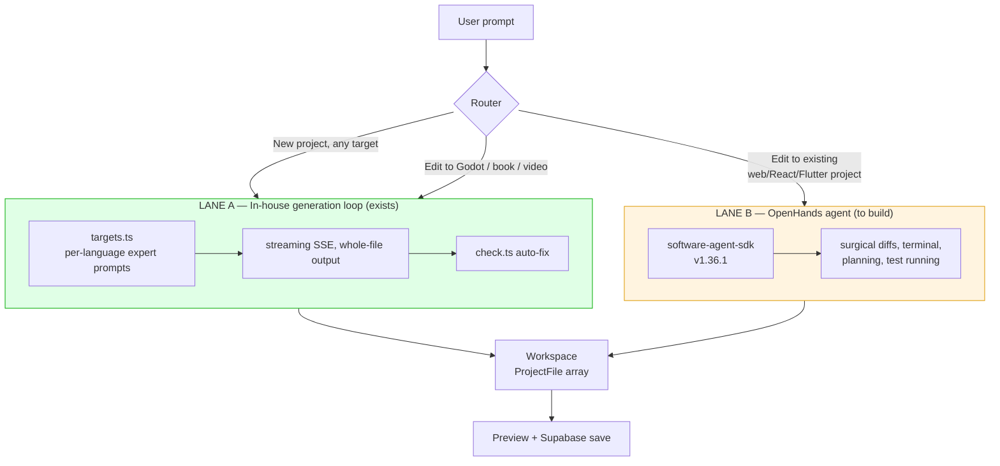
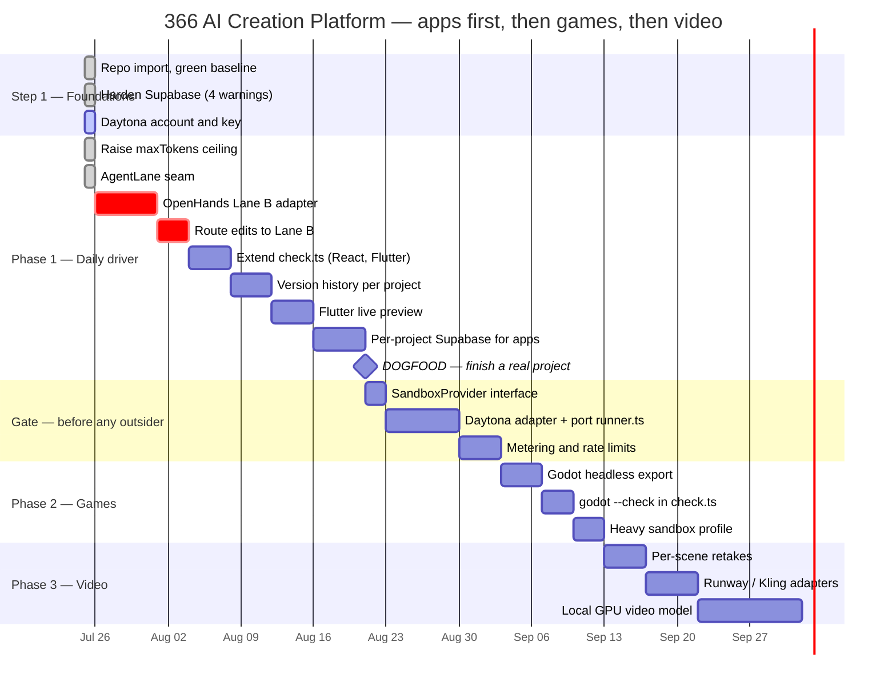

# 366 AI Creation Platform — Revised Roadmap

**Revised:** 25 July 2026, after reading the v2.0 codebase
**Supersedes:** the generic "build a Lovable clone" sequencing
**Decisions locked with Jordi:** two agent lanes · Phase 1 is local/team only · all four app targets wanted first · games next · video last

---

## 0. The re-sequencing, and why

Two answers changed the plan materially.

### 0.1 Sandboxing is no longer the Phase 1 blocker

Phase 1 is **you and the team, running locally or behind `ACCESS_PASSWORD`.** That means `src/services/runner.ts` executing generated code on the host is *acceptable* — and your own `docs/PHASES.md` already says exactly this:

> *"Fine for in-house use with our own generations; MUST move into real sandboxing before outside users get access."*

You are generating the code. You are running the code. There is no untrusted party in the loop yet. Sandboxing therefore moves out of Phase 1 and becomes the **gate on the public milestone**, not a prerequisite for finishing your own projects.

**The trigger is explicit, and should be treated as a hard stop:**

> 🚧 **The moment anyone who is not you or the team can type a prompt into this platform, sandboxing ships first.** Not "soon after." First. That includes a demo to a client, a link sent to a friend, and leaving Render open without `ACCESS_PASSWORD`.

Daytona still gets set up in Step 1 — the account, the key, the $200 credit. It just isn't wired into `runner.ts` until the games phase, which needs heavier execution anyway.

### 0.2 The real Phase 1 blocker is edit precision

Here is what actually stops you finishing a project today. From `src/routes/generate.ts`:

```ts
// buildMessages() — every edit re-sends the ENTIRE project
const existing = currentFiles?.length ? serializeFiles(currentFiles) : currentCode;
return [
  { role: "user", content: "Here is my current project:\n\n" + existing },
  { role: "assistant", content: "Understood. What would you like to change?" },
  { role: "user", content: prompt },
];
```

…and the model is asked for **the whole project back**. Four consequences, in ascending order of severity:

| # | Consequence | Why it bites |
|---|---|---|
| 1 | Cost scales with project size on *every* edit | "Make the button blue" re-reads and re-writes 30 files |
| 2 | Latency scales the same way | Regenerating a whole project to change one line |
| 3 | **Hard output ceiling at 16,000 tokens** | `config.maxTokens: 16000`, applied in all three providers. A realistic multi-file React project exceeds this. The model truncates and **files silently vanish** |
| 4 | **Unrelated regressions** | Nothing constrains the model to leave file #12 alone while editing file #3. Edit #40 can quietly break edit #12 |

Item 3 is a wall, not a slope. Item 4 is why "finish a real project" is currently not achievable — you cannot build something over forty edits if any edit can silently undo an earlier one.

**This is precisely what OpenHands is built to do well**, and precisely what your in-house loop does worst. Which makes the two-lane decision the right one rather than a compromise.

---

## 1. Architecture — two agent lanes

Both lanes sit behind one interface. The platform routes per task; the user never has to know which ran.



### Why each lane keeps its job

| | **Lane A — in-house** | **Lane B — OpenHands** |
|---|---|---|
| Owns | First generation, all targets | Iterative edits to real codebases |
| Strength | Bespoke expert prompts per target; Godot/book/video pipelines nothing else has | Surgical file edits, terminal access, runs tests, plans multi-step work |
| Weakness | Whole-file regeneration; 16k ceiling | No concept of Godot projects, book pipelines, or Veo scene JSON |
| Status | ✅ Shipped, 38 tests green | ⬜ To build |
| Working rule #4 | "Own the core" — the gateway and prompts stay yours | "Rent the edges" — code-editing is a commodity now |

This satisfies **"we do want all options"** without rewriting a tested system. Lane A is untouched. Lane B is additive.

### The seam that makes it work

Both lanes must read and write the same thing: the `ProjectFile[]` array that `lib/files.ts` already defines and that Supabase already persists in `projects.files`. Define that as the contract in Step 3 and the lanes stay swappable forever.

```ts
// The interface both lanes implement
interface AgentLane {
  id: "inhouse" | "openhands";
  supports(target: string, mode: "create" | "edit"): boolean;
  run(req: { prompt: string; target: string; files: ProjectFile[] }):
    AsyncIterable<AgentEvent>;   // same SSE event shape the UI already speaks
}
```

The UI already consumes `{type:"chunk"|"fixing"|"done"|"error"}`. Lane B emits the same events. **The frontend does not change.**

---

## 2. Phase 1 — "finish our own projects"

**Definition of done:** you build something real, in this platform, over 40+ edits, and ship it — without dropping to VS Code out of frustration.

All four target types you named are in scope. Here they are ranked by *effort to daily-driver quality*, which is not the same as importance:

| Target | Today | Gap to daily driver | Effort |
|---|---|---|---|
| 🌐 Marketing sites / landing pages | ✅ Single-file HTML, instant preview | Basically none — this already works | **Lowest** |
| ⚛️ Web apps / dashboards | ✅ Multi-file React + Vite, live preview | Edit precision. The 16k ceiling. | **High — this is the main work** |
| 🗄 Business / internal tools | ⚠️ React generation works; no DB for generated apps | Needs per-project Supabase provisioning | **Medium** |
| 📱 Mobile / Flutter | ⚠️ Generates a real project, ZIP download only | No live preview; no `dart analyze` in `check.ts` | **Medium-high** |

### Work items, in dependency order

**1.1 — Raise the ceiling — ✅ done 25 Jul 2026**
`config.maxTokens` was a single global `16000` shared by all three providers. Now per-provider, env-overridable, defaulting to each model's documented maximum output: Claude Sonnet 4.5 **64,000**, GPT-4.1 **32,768**, Gemini 2.5 Pro **65,536**. A `maxTokensFor()` helper falls back to the old 16,000 for any provider added later that forgets to declare one. Silent file loss on large projects stops here. *5 tests added.*

**1.2 — Build Lane B: the OpenHands adapter — 🔨 adapter merged, not yet run live**
`src/lanes/openhands.ts` talks to an OpenHands agent-server over the OpenAI-compatible gateway with `fetch`, no SDK. Edits to web/react/flutter/python route to it; first generation and godot/book/video stay on Lane A; with `OPENHANDS_SERVER_URL` unset the platform behaves exactly as before. An unreachable server falls back to Lane A automatically — **verified against a dead port, request completes normally**. Two known gaps: no token streaming (the gateway rejects `stream: true`) and files still travel in the prompt rather than a real workspace. Full write-up, including the two fallback bugs a smoke test caught, in [`step-03-openhands.md`](step-03-openhands.md). *15 tests added, 67 total.*

**1.2b — Next iteration on Lane B**
The `AgentLane` seam is built and live (`src/lanes/`): `types.ts` (contract + wire events), `inhouse.ts` (Lane A, logic moved out of the route unchanged), `index.ts` (priority-ordered registry + router). `routes/generate.ts` is now HTTP-only — validate, select lane, relay events, frame errors. **The wire format is byte-identical, so `public/index.html` needed no edits.** Verified by smoke test against a running server. *9 tests added.*

Remaining: install `openhands-agent-server` from [`software-agent-sdk`](https://github.com/OpenHands/software-agent-sdk) (v1.36.1, Python 3.12+, `uv`), implement `AgentLane` against it, point it at `ANTHROPIC_API_KEY` via `LLM_MODEL` / `LLM_API_KEY`, materialise `ProjectFile[]` into its workspace and read the diff back out. Registration is one line in `lanes/index.ts` — the slot is already commented in place.

**1.3 — Route edits to Lane B**
`modeOf()` already distinguishes create from edit and is tested. Once Lane B exists, its `supports()` returns true for `edit` on web/React/Flutter and false otherwise; the router does the rest. Lane A stays last as the always-true fallback.

**1.3b — UI layout audit — ✅ done 25 Jul 2026**
Done ahead of schedule because the prototype is going on a real domain. Three fixes in `public/index.html`: `100dvh` instead of `100vh` (mobile browsers count the address bar, pushing the prompt box off-screen); the 11-control header now scrolls in one row on phones instead of wrapping into four; and the accent colours were darkened because white text on `#6c7bff` measured **3.55:1**, failing WCAG AA on the Build button and every user chat bubble. Plus favicon, meta description, `focus-visible` outlines, and sane code wrapping. Details and measurements in [`step-02-hosting.md`](step-02-hosting.md) §2.5.

**1.4 — Extend `check.ts` beyond Python**
It currently checks only `.py` via `py_compile`. Add: `tsc --noEmit` / `vite build` for React, `dart analyze` for Flutter. The file's own comment already anticipates this. Verification is what turns "the AI wrote something" into "the AI wrote something that works."

**1.5 — Version history per project**
Every edit becomes a commit. This is the actual insurance against consequence #4 above — when an edit breaks something, you roll back instead of re-prompting your way out. `projects.files` is already jsonb; add a `project_versions` table.

**1.6 — Flutter live preview**
`flutter build web` in the runner, served like the React path. Turns Flutter from download-a-ZIP into a real target.

**1.7 — Per-project Supabase for generated apps**
Unblocks the business/internal-tools category. Generated CRUD apps need a database of their own.

---

## 3. Phase 2 — Games

Starts once Phase 1 is a daily driver. **This is where Daytona gets wired in**, because Godot work needs execution capacity the host shouldn't provide:

- Godot headless export to HTML5 (automated — currently a manual editor step)
- `godot --check` added to `check.ts`
- Game art pipeline already exists (`assets.json` + image gateway, Phase 4.1 ✅)
- Heavier sandbox profile: Godot binary, larger disk, longer timeouts

The sandbox tier split you raised belongs here rather than Phase 1 — a Godot export and a Vite dev server want genuinely different machines.

## 4. Phase 3 — Video

Already the most complete pipeline in the repo (plan → keyframes → motion → narration → music, Phases 5.1–5.6 ✅). Remaining: per-scene retakes, Runway/Kling adapters, and the local-GPU open-source video model noted in `PHASES.md`. Deliberately last — it works today and is not blocking anything.

---

## 5. Timeline



---

## 6. What changes in the existing docs

`creation-platform/docs/PHASES.md` remains the historical record — it is genuinely good and should not be rewritten. This file is the forward-looking plan. Two corrections worth folding back into PHASES.md when convenient:

1. **Phase 3's "Next.js frontend"** — the platform is Express + a single `public/index.html` and works fine. A Next.js rewrite is not required for multi-user; auth, metering, and sandboxing are.
2. **Phase 2's "automatic error-fix loop (this is Bolt's core trick)"** — half-built. `check.ts` does it for Python only. Item 1.4 above finishes the thought.

---

## Sources

- Repository read directly: `creation-platform/src/{routes/generate.ts, lib/{files,check,extract}.ts, config.ts, targets.ts, services/{runner,supabase}.ts}`, `creation-platform/docs/PHASES.md`
- [OpenHands — software-agent-sdk](https://github.com/OpenHands/software-agent-sdk) (v1.36.1, 15 Jul 2026)
- [OpenHands — SDK documentation](https://docs.openhands.dev/sdk)
- [Daytona — Sandboxes](https://www.daytona.io/docs/en/sandboxes)
- [Daytona — API Keys](https://www.daytona.io/docs/en/api-keys/)
