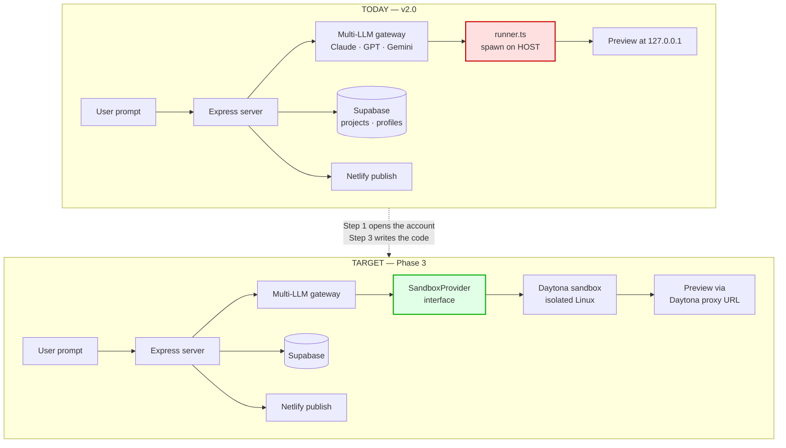
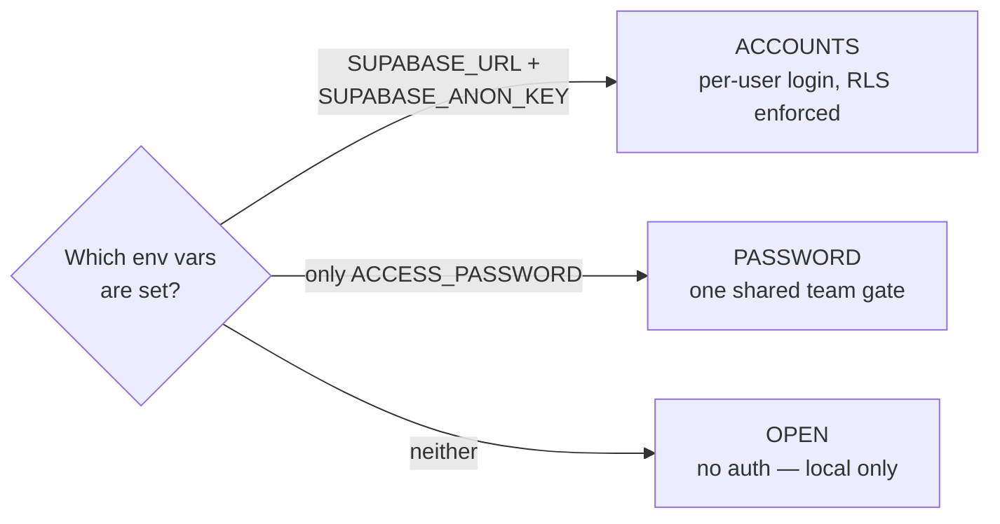
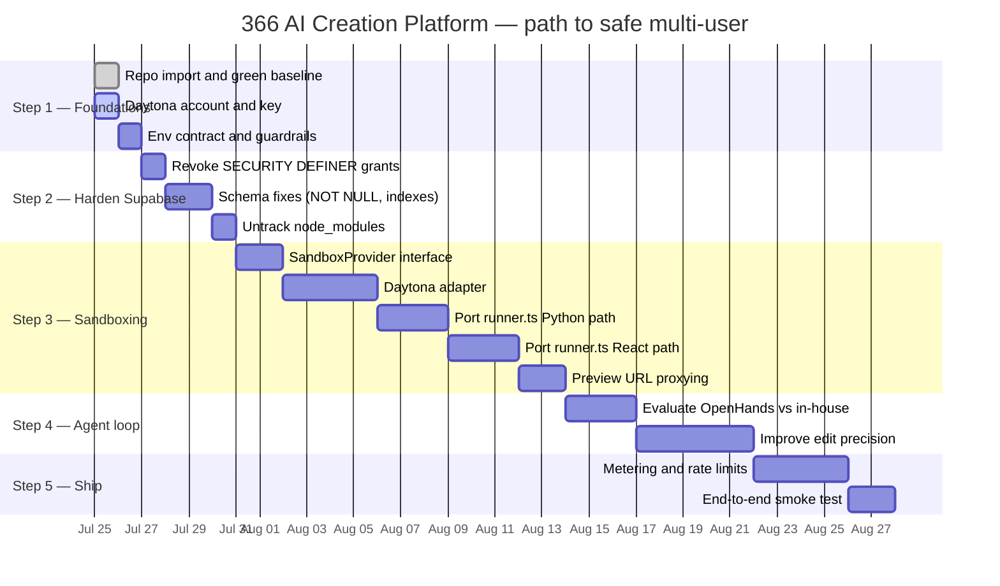

# Step 1 — Foundations: Accounts, Keys, and Repository Import

**Project:** 366 Industries AI Creation Platform — the in-house Lovable/Bolt/Replit alternative
**Repository:** [`Hunting-Fishing/366-AI-Software-Homebrew`](https://github.com/Hunting-Fishing/366-AI-Software-Homebrew)
**Step 1 goal:** every account created, every key issued, every environment variable named, the codebase imported, and a verified green baseline.
**Written:** 25 July 2026. Audience assumes no prior DevOps experience — every command is given in full.

---

## 1.0 Reality check — where the project actually is

Before planning anything, the repository was cloned and read. It is not a greenfield project. **`creation-platform` is at v2.0 and works.** Several assumptions in a generic "build a Lovable clone" plan are already obsolete here, and one is actively misleading.

| Assumption in the generic plan | Reality in this repo |
|---|---|
| Scaffold a Next.js frontend | It's **Express + TypeScript** (`tsx`), served with a single `public/index.html`. No React frontend, no Next.js. |
| Deploy the platform to Vercel | Platform hosting is **Render.com** via `Dockerfile` (`DEPLOY-ONLINE.md`). Generated apps publish to **Netlify** (`src/services/deploy.ts`). Vercel is not in the stack. |
| Provision a Supabase backend | **Already done** — Phase 3.2 (storage) and 3.3 (accounts + RLS) shipped. `src/services/supabase.ts` talks to PostgREST directly, no SDK. |
| Set up model provider keys | **Already done** — three-provider gateway (Anthropic / OpenAI / Google) live since Phase 0. |
| Install OpenHands as the agent | The platform has **its own agent loop** already: streaming generation, multi-file output, and an auto-fix loop (`src/lib/check.ts`) that feeds syntax errors back to the model. OpenHands would be a *replacement*, not an addition — see §1.7. |
| Run isolated cloud sandboxes | ❌ Not done — but see the sequencing note below. Deferred to the games phase. |

So the honest scope of Step 1 is narrower and sharper than the generic plan implies:

> **Import the repo, verify it builds, and open the one account the project genuinely does not have yet — Daytona.**

> ⚠️ **Sequencing note added after review with Jordi.** Phase 1 is *local / team only*, so unsandboxed execution is not a Phase 1 blocker — it is the gate on letting anyone else in. Daytona is still set up here (account, key, $200 credit), but it gets wired into `runner.ts` at the games phase. The actual Phase 1 blocker is **edit precision**, not isolation. See [`roadmap.md`](roadmap.md) §0 for the full reasoning.

### What was verified, not assumed

```
✅ git clone            → 4 commits, branch main, clean working tree
✅ npx tsc --noEmit     → exit 0, zero type errors
✅ npx tsx --test       → 38 passed, 0 failed
```

That is your green baseline. Everything in Step 2 onwards builds on it.

---

## 1.1 What the repository contains

```
366-AI-Software-Homebrew/
├── BLUEPRINT.md              Architecture doc, 18 Jul 2026
├── ai-app-builder/           v0.1 — the original JS prototype, kept as reference
└── creation-platform/        v2.0 — THE ACTIVE PLATFORM
    ├── src/
    │   ├── config.ts         model names, overridable via .env
    │   ├── targets.ts        per-language expert system prompts
    │   ├── providers/        anthropic · openai · google · images · speech · videos
    │   ├── routes/           auth · generate · image · preview · projects · publish · video
    │   ├── services/         auth · build · deploy · motion · projects · runner · studio · supabase
    │   ├── middleware/auth.ts  three auth modes
    │   └── lib/              check (auto-fix) · extract · files · sse
    ├── tests/                10 test files, 38 assertions
    ├── docs/                 PHASES.md · TECH-STACK.md · PHASE3-CHECKLIST.md
    └── Dockerfile            Node + Python + FFmpeg
```

**The layer that matters for Step 1 is `src/services/runner.ts`.** Read its header comment — the previous author documented the problem precisely:

> *"SECURITY NOTE: this runs AI-generated code on this machine. That's acceptable for our own in-house use with our own generations. Before offering this to outside users, it MUST move into real sandboxing (Docker/Firecracker — Phase 3). Do not expose this server to the public internet as-is."*

Today `runner.ts` writes generated files into `os.tmpdir()` and calls `spawn("python", ["app.py"])` — or for React, `npm install` followed by `npx vite`. Both execute untrusted, model-authored code with the full privileges of the platform process. `npm install` is the sharper edge of the two: a generated `package.json` can name any package on the registry, and install scripts run automatically.

That is what Daytona is being brought in to fix.

---

## 1.2 System architecture, current and target



---

## 1.3 Accounts — what exists, what's missing

| # | Service | Status | Used for | Where |
|---|---|---|---|---|
| 1 | **GitHub** | ✅ Have it | Source of truth | [`Hunting-Fishing/366-AI-Software-Homebrew`](https://github.com/Hunting-Fishing/366-AI-Software-Homebrew) |
| 2 | **Supabase** | ✅ Have it | Projects, accounts, RLS | Project `ujkizgblscqcejghxemb`, `ACTIVE_HEALTHY` |
| 3 | **Anthropic** | ✅ Have it | Primary code model | `ANTHROPIC_API_KEY` |
| 4 | **OpenAI** | ✅ Have it | Alt model + `gpt-image` | `OPENAI_API_KEY` |
| 5 | **Google AI Studio** | ✅ Have it | Gemini, Veo, TTS | `GOOGLE_API_KEY` |
| 6 | **Netlify** | ✅ Have it | Publishing generated apps | `NETLIFY_TOKEN` |
| 7 | **Render.com** | ✅ Have it | Hosting the platform | `DEPLOY-ONLINE.md` |
| 8 | **Daytona** | ❌ **Missing** | **Sandboxed code execution** | **← the only Step 1 action** |

### 1.3.1 Open the Daytona account

1. Sign up at [app.daytona.io](https://app.daytona.io). New accounts receive **$200 in credit**, which is more than enough to build and test Phase 3.
2. Go to **Dashboard → Keys → Create Key**.
3. Name it `366-platform-dev`.
4. Set an **expiry date**. Twelve months is reasonable. Never choose "never" — an unexpirable key is a permanent liability if it ever leaks.
5. Grant **only these two scopes**: `write:sandboxes` and `delete:sandboxes`. ([Daytona: API Keys](https://www.daytona.io/docs/en/api-keys/))
6. Copy the key immediately — it is shown once — into `DAYTONA_API_KEY` in `creation-platform/.env`.

**Why only two scopes.** Daytona also offers `write:snapshots` and `write:registries`. A key holding those can modify the base images every future sandbox boots from — that is a supply-chain foothold, and our platform never needs it. Least privilege is not paranoia here; it is the difference between a leaked key costing you some compute and a leaked key poisoning every sandbox you ever run.

### 1.3.2 Verify the account works

Install the CLI:

```bash
# Windows (PowerShell)
irm https://get.daytona.io/windows | iex

# macOS / Linux
brew install daytonaio/cli/daytona
```

```bash
daytona login
daytona sandbox list
```

**An empty list is the correct answer.** It means authentication succeeded and you have no sandboxes yet. An auth error means the key or login did not take.

---

## 1.4 Choosing the sandbox provider

| | **Daytona** ✅ chosen | **E2B** | **WebContainers** |
|---|---|---|---|
| Isolation | Managed cloud VMs/containers | Firecracker microVMs | Runs in the user's browser tab |
| Cold start | Sub-second (marketed ~90 ms) | ~150–200 ms | Instant — no server |
| Runs `python app.py` | ✅ | ✅ | ❌ WASM only |
| Runs `npm install` + Vite | ✅ | ✅ | ✅ (its speciality) |
| Runs FFmpeg | ✅ | ✅ | ❌ |
| Server compute cost | Per-second | Per-second | **$0** — user's CPU |
| Git built into SDK | ✅ First-class | Via shell | Limited |
| Preview URLs | ✅ Built-in proxy | Via exposed ports | localhost in-tab |
| Persistent volumes | ✅ | ✅ | ❌ ephemeral |
| Licence | OSS core + managed cloud | OSS core + managed cloud | Commercial licence for business use |

**Why Daytona.** Our two hottest operations are *materialise a file tree* and *expose a preview URL*. Daytona ships both as first-class SDK primitives — [git operations](https://www.daytona.io/docs/en/git-operations) and a [preview proxy](https://www.daytona.io/docs/en/preview) — where E2B would have us shell-scripting them. Given `runner.ts` already does exactly these two things locally, the port is close to mechanical.

**Why not E2B.** Genuinely close. Firecracker isolation is arguably stronger. If Daytona's pricing or region coverage disappoints, switching should cost a day — which is why §1.6 insists on the interface.

**Why not WebContainers.** It is the cheapest option by far — the compute is the user's own browser — and it is exactly what Bolt.new uses. But this platform generates **Python/Flask, Godot, and FFmpeg video pipelines**, none of which run under WASM. It also carries a commercial licence obligation. It stays disqualified until and unless the product narrows to front-end-only output.

---

## 1.5 The environment variable contract

The runtime file is `creation-platform/.env`. The root [`.env.example`](../.env.example) is the canonical reference — **its variable names were read out of `src/`, not invented.**

| Variable | Read by | Secret? | Status |
|---|---|---|---|
| `ANTHROPIC_API_KEY` | `providers/anthropic.ts` | 🔴 Yes | ✅ Set |
| `OPENAI_API_KEY` | `providers/openai.ts`, `images.ts` | 🔴 Yes | ✅ Set |
| `GOOGLE_API_KEY` | `providers/google.ts`, `videos.ts`, `speech.ts` | 🔴 Yes | ✅ Set |
| `SUPABASE_URL` | `services/supabase.ts`, `auth.ts` | 🟢 No | ✅ Set |
| `SUPABASE_SERVICE_KEY` | `services/supabase.ts` | 🔴 **Critical** | ✅ Set |
| `SUPABASE_ANON_KEY` | `services/auth.ts` | 🟡 Low | Enables accounts mode |
| `ACCESS_PASSWORD` | `middleware/auth.ts` | 🔴 Yes | Required when public |
| `NETLIFY_TOKEN` | `services/deploy.ts` | 🔴 Yes | Optional |
| `DAYTONA_API_KEY` | *nothing yet — Phase 3* | 🔴 Yes | ❌ **Add in Step 1** |
| `SANDBOX_PROVIDER` | *nothing yet — Phase 3* | 🟢 No | Set to `local` for now |

**The three auth modes**, checked in order by `src/middleware/auth.ts`:



**Non-negotiable:** if the platform is reachable from the internet in `OPEN` mode, anyone on the internet can make it execute arbitrary generated code on your host. Set `ACCESS_PASSWORD` at minimum, `SUPABASE_ANON_KEY` preferably.

---

## 1.6 Two structural issues found during import

Neither blocks Step 1. Both get worse the longer they wait.

### 1.6.1 `node_modules` is committed to git

`ai-app-builder/node_modules/` has **628 tracked files**. This bloats every clone, generates noise in every diff, and — the real risk — means a dependency's code is pinned in your history where `npm audit` will never look at it.

The root [`.gitignore`](../.gitignore) added in this step ignores `node_modules/` going forward, but **`.gitignore` does not untrack files already committed.** Removing them is a deliberate act:

```bash
cd "D:\Lovable Remake"
git rm -r --cached ai-app-builder/node_modules
git commit -m "chore: untrack ai-app-builder/node_modules"
```

This deletes nothing on disk. Anyone who has cloned will need to run `npm install` in that folder — which, since `ai-app-builder` is explicitly "kept as reference", is unlikely to affect anyone.

### 1.6.2 Four security warnings on the live Supabase project

Supabase's own linter returned four WARN-level findings today, all one root cause: two `SECURITY DEFINER` functions are exposed as public REST endpoints.

| Function | Callable by | Endpoint |
|---|---|---|
| `public.handle_new_user()` | `anon`, `authenticated` | `POST /rest/v1/rpc/handle_new_user` |
| `public.rls_auto_enable()` | `anon`, `authenticated` | `POST /rest/v1/rpc/rls_auto_enable` |

`SECURITY DEFINER` means the function executes with its **owner's** privileges (`postgres`), not the caller's. `handle_new_user()` is the Phase 3.3 signup trigger helper — it is meant to be fired by the auth system, never by an anonymous HTTP request. `rls_auto_enable()` is the more serious one: a function that toggles Row Level Security should not be reachable from the public API under any circumstances.

Remediation SQL, with the reasoning, is in [`docs/reference/current-supabase-schema.sql`](reference/current-supabase-schema.sql). Queued as the first task of Step 2. ([Supabase linter 0028](https://supabase.com/docs/guides/database/database-linter?lint=0028_anon_security_definer_function_executable), [0029](https://supabase.com/docs/guides/database/database-linter?lint=0029_authenticated_security_definer_function_executable))

---

## 1.7 OpenHands or not? — ✅ **Decided: both**

> **Resolved 25 July 2026.** Jordi's call: run **two agent lanes**, not one. Lane A is the in-house loop, kept for first generation and for the targets nothing else can do (Godot, book, video). Lane B is OpenHands, used for surgical edits to existing web/React/Flutter codebases. Both sit behind one `AgentLane` interface over the same `ProjectFile[]` contract, so the frontend never changes. Full design in [`roadmap.md`](roadmap.md) §1.
>
> The analysis below is retained because it is *why* the answer is "both" rather than "pick one."

The original plan called for installing the OpenHands agent server. Having read the code, that needs re-examining rather than executing.

**The platform already has an agent loop.** `routes/generate.ts` streams generation over SSE, `lib/files.ts` parses multi-file output with path-traversal protection, and `lib/check.ts` implements the auto-fix cycle — syntax-check the generated Python, feed failures back to the model, stream a correction. `docs/PHASES.md` correctly identifies this as "Bolt's core trick."

| | **Keep the in-house loop** | **Adopt OpenHands** |
|---|---|---|
| Effort | Zero — it exists and passes tests | Substantial rewrite of `routes/generate.ts` |
| Fits "own the core, rent the edges" | ✅ The gateway is the core | ❌ Rents the core |
| Multi-provider | ✅ Already three providers | ✅ Via LiteLLM |
| Agentic file editing | Regenerates whole files | Surgical edits, terminal access, planning |
| Non-web targets (Godot, Flutter, video) | ✅ Purpose-built via `targets.ts` | ❌ Would need custom tooling |
| Maturity | Yours, ~2k lines | SWE-bench 77.6%, backed by a research team |

**Two facts that should inform the call:**

1. **`OpenHands/OpenHands-Server` was archived on 17 January 2026** and is read-only. Any tutorial pointing at it is stale. The maintained package is [`OpenHands/software-agent-sdk`](https://github.com/OpenHands/software-agent-sdk) (v1.36.1, 15 July 2026), which bundles `openhands-agent-server`. Requires Python 3.12+ and `uv`.

2. OpenHands is strongest at *editing an existing codebase* — the thing your loop does worst, since it currently regenerates whole files. It is weakest at your differentiated targets: Godot games, Flutter, book pipelines, FFmpeg video.

**Position, now adopted:** keep the in-house loop as the default path for all targets, and add OpenHands as a second lane for the "edit this existing project" case — where surgical diffs beat whole-file regeneration. That preserves working rule #4 in `PHASES.md` ("own the core, rent the edges"), avoids rewriting a tested system, and answers "we want all options" without forcing a choice.

---

## 1.8 Definition of done for Step 1

- [x] Repository cloned into `D:\Lovable Remake`, branch `main`, clean tree
- [x] `npx tsc --noEmit` → exit 0
- [x] `npx tsx --test tests/*.test.ts` → 38 passed, 0 failed
- [x] Root `.gitignore` and `.env.example` written from the actual code
- [x] Live Supabase schema snapshotted to `docs/reference/`
- [ ] **Daytona account created, key issued with only `write:sandboxes` + `delete:sandboxes`**
- [ ] `daytona sandbox list` returns without an auth error
- [ ] `DAYTONA_API_KEY` added to `creation-platform/.env`
- [ ] Anthropic monthly spend limit set (recommend $50 to start)
- [ ] GitHub → Settings → Code security → secret scanning + push protection enabled
- [ ] `git rm -r --cached ai-app-builder/node_modules` committed
- [ ] Working branch created: `git checkout -b platform/step-01-foundations`

---

## 1.9 Guardrails to set now

| Guardrail | Where | Setting |
|---|---|---|
| Model spend cap | Anthropic Console → Billing | $50/month, alert at 80% |
| Sandbox auto-stop | Daytona sandbox config | 15 min idle |
| Sandbox key scope | Daytona → Keys | `write:sandboxes`, `delete:sandboxes` only |
| Key expiry | Daytona → Keys | 12 months + calendar reminder |
| Secret scanning | GitHub → Settings → Code security | Enable + push protection |
| Never public in OPEN mode | `creation-platform/.env` | `ACCESS_PASSWORD` set before any deploy |
| RLS on all tables | Supabase | ✅ already on for `profiles`, `projects` |

**The one that bites hardest:** sandboxes that never idle-stop. A user opens a preview, closes the tab, and the sandbox bills per second until someone notices the invoice. Configure the idle timeout *before* writing a single line of sandbox code, not after.

---

## 1.10 Where Step 1 sits in the build



---

## Sources

- [Daytona — API Keys](https://www.daytona.io/docs/en/api-keys/)
- [Daytona — Sandboxes](https://www.daytona.io/docs/en/sandboxes)
- [Daytona — Git Operations](https://www.daytona.io/docs/en/git-operations)
- [Daytona — Preview](https://www.daytona.io/docs/en/preview)
- [Supabase — Database Migrations](https://supabase.com/docs/guides/deployment/database-migrations)
- [Supabase CLI — `supabase link`](https://supabase.com/docs/reference/cli/supabase-link)
- [Supabase CLI — `supabase db push`](https://supabase.com/docs/reference/cli/supabase-db-push)
- [Supabase — database linter 0028](https://supabase.com/docs/guides/database/database-linter?lint=0028_anon_security_definer_function_executable)
- [Supabase — database linter 0029](https://supabase.com/docs/guides/database/database-linter?lint=0029_authenticated_security_definer_function_executable)
- [OpenHands — software-agent-sdk](https://github.com/OpenHands/software-agent-sdk)
- [OpenHands-Server — archived 17 Jan 2026](https://github.com/OpenHands/OpenHands-Server)
- Repository read directly: [`Hunting-Fishing/366-AI-Software-Homebrew`](https://github.com/Hunting-Fishing/366-AI-Software-Homebrew) — `creation-platform/src/`, `creation-platform/docs/PHASES.md`, `BLUEPRINT.md`
